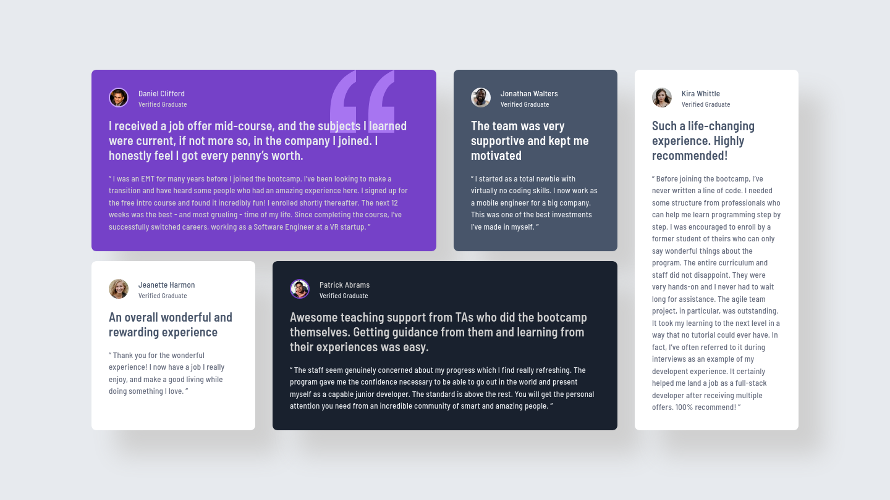
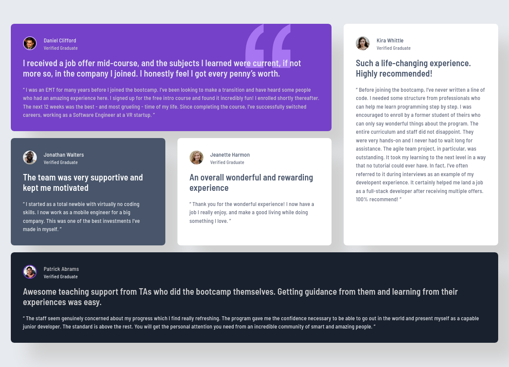
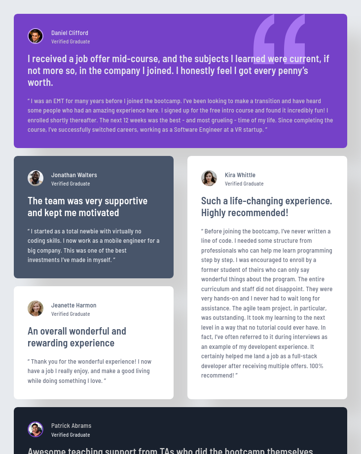

# Frontend Mentor - Testimonials grid section solution

This is a solution to the [Testimonials grid section challenge on Frontend Mentor](https://www.frontendmentor.io/challenges/testimonials-grid-section-Nnw6J7Un7).

## Overview

### The challenge

Users should be able to:

- View the optimal layout for the site depending on their device's screen size

### Screenshots

### Links

- [Solution URL](https://www.frontendmentor.io/solutions/responsive-testimonials-grid-section-R8RWnV5oWf)
- [Live Site URL](https://nik-i-net.github.io/testimonials-grid-section/)

### Built with

- Semantic HTML5 markup
- CSS variables
- CSS Grid
- Responsive layout
